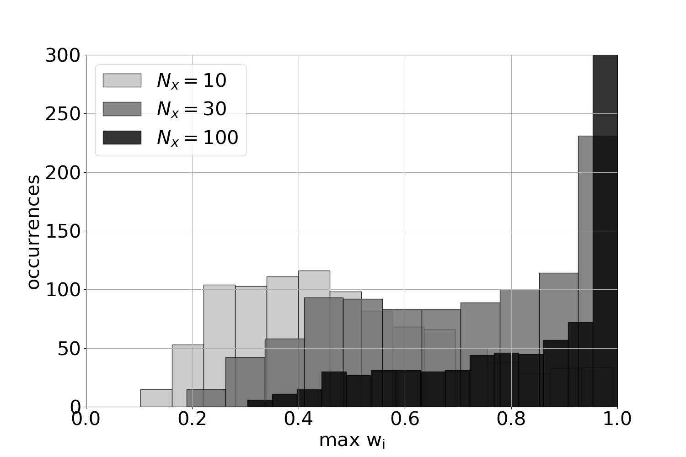

# Particle filter standard implementation

Code with simple example of linear and gaussian model.
The present codes illustrate and introduce the implementation of a particle filter with a linear and gaussian example (e.g., Snyder et al. 2008. Bengtsson et al. 2008, Kim et al. 2022).

## Maximal weight as function of the dimension

## Averaged squared error as function of the dimension

## Required ensemble size as function of the dimension (for a given maximal weight)
