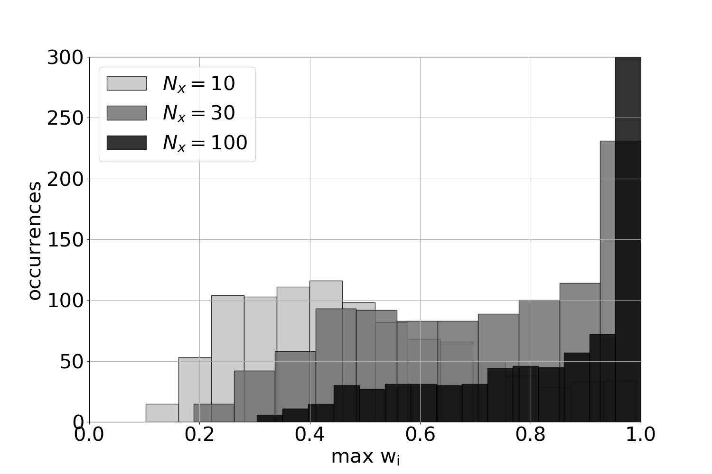

# Particle filter standard implementation

Code with simple example of linear and gaussian model.
The present codes illustrate and introduce the implementation of a particle filter with a linear and gaussian example (e.g., Snyder et al. 2008. Bengtsson et al. 2008, Kim et al. 2022).

## 1. Maximal weight as function of the dimension
### 1a. Run the main code of the particle filter

Change the makefile to run the PF_main.py and to plot the histograms of the maximal weights using:

```bash
pre: runmain plot

runmain:
	python PF_main.py
plot:
	python plot_histogram_wmax.py

```



## Averaged squared error as function of the dimension

## Required ensemble size as function of the dimension (for a given maximal weight)
